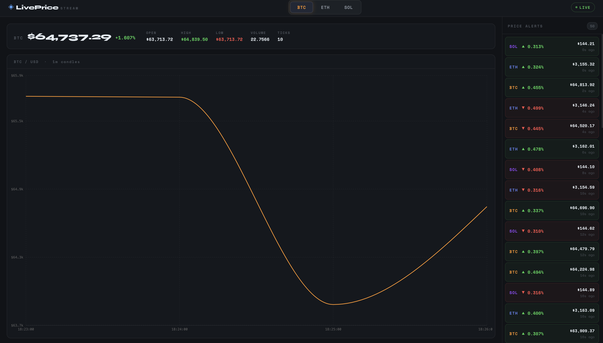
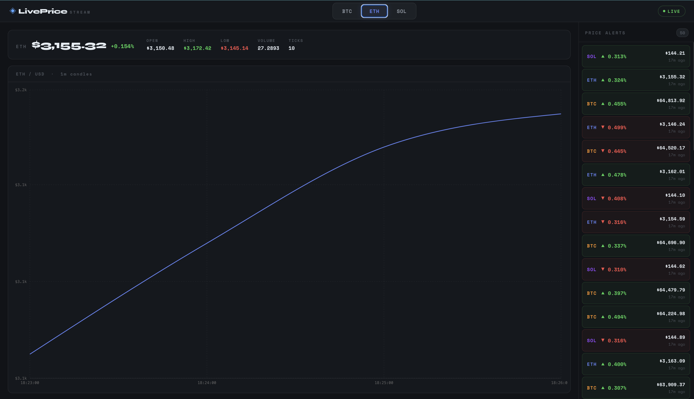
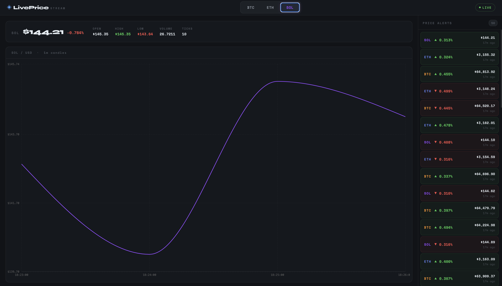

A real-time market data streaming pipeline built with Apache Kafka, Kafka Streams, Spring Boot, and React. 
Price ticks flow from a simulated producer through a stateful stream processing topology, get persisted to a database, and are broadcast live to a React dashboard over WebSocket.

## Screenshots

## Tech Stack
- **Backend**: Java 21, SpringBoot 3.5.13, Spring Web, Spring Kafka, Spring Websocket
- **Persistence**:Spring Data JPA, H2 (dev)
- **Message Broker**: Apache Kafka + Zookeeper (Docker)
- **Stream Processing**: Kafka Streams (tumbling windows, stateful aggregation)
- **Frontend**: React 19, Vite 8, Recharts
- **Infrastructure**: Docker Compose

## Switching to Real Market Data 
- The price simulator is intentionally isolated in PriceDataService.
- To replace it with live CoinGecko data:
   1. Add a CoinGecko API call
   2. Annotate the PriceDataService with @Profile("simulated") 
   3. Create a new CoinGeckoPriceService annotated with @Profile("real) implementing the same fetchTick method
   4. Set spring.profiles.active = real in application.yml
 

## Future Improvements
Backend
- Switch to a PostgreSQL database
- Add cursor-based pagination
- Add authentication
- Add alert persistence

DevOps/Infrastructure
- Add a Github Actions workflow that runs ./mvnw test on every push and npm run build for the frontend
- Add Spring Boot and the React frontend as services in docker-compose.yml file so entire app starts with a single docker compose up command

## Getting Started
1. Docker desktop open 
2. Start kafka (from project root) = docker compose up -d
3. Confirm both containers are running = docker ps
4. Start backend (new terminal) = cd backend  then  ./mvnw spring-boot:run -Dmaven.test.skip=true
5. Start frontend (new terminal) = cd frontend   then npm install  then npm run dev
6. Open dahsboard at = http://localhost:5173
7. Verify the pipeline = docker exec -it kafka kafka-topics \
  --bootstrap-server localhost:9092 \
  --describe --topic raw-price-ticks

